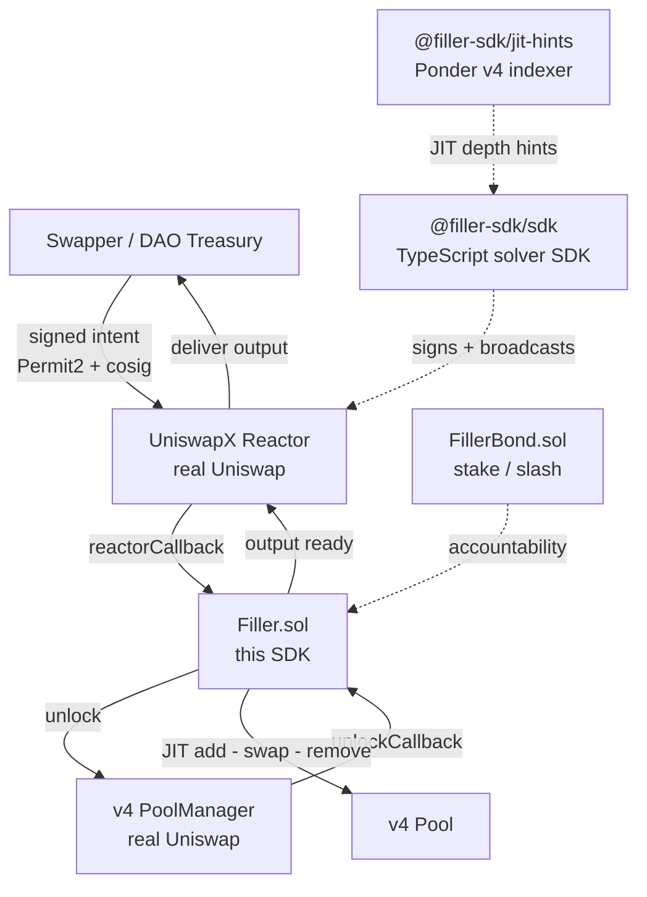

# Filler SDK

> *"Tres archivos y un bond."*

[](https://github.com/DavidZapataOh/filler-sdk/actions/workflows/ci.yml)
[](https://github.com/DavidZapataOh/filler-sdk/actions/workflows/docs.yml)
[](./LICENSE)
[](./contracts/foundry.toml)
[](https://bun.sh)

The SDK to deploy vertical UniswapX solvers in `npm install`.

[**Documentation**](https://docs.filler-sdk.xyz) · [**FEEDBACK.md →**](./FEEDBACK.md) (developer feedback for the Uniswap Foundation track)

---

## Quickstart — first verified on-chain fill in 25 seconds

```bash
git clone https://github.com/DavidZapataOh/filler-sdk
cd filler-sdk
bun install
bun run e2e:fork
```

Spawns an anvil mainnet fork, deploys `Filler.sol` + `FillerBond.sol` at deterministic addresses, initializes a v4 USDC/WETH pool, seeds liquidity, funds wallets, stakes the bond, signs an intent, and executes a real on-chain fill against the canonical UniswapX V2 Reactor + real Permit2 + real v4 PoolManager. Real swap: 100 USDC → 0.043 WETH, JIT spread captured by the Filler.

[Detailed quickstart →](https://docs.filler-sdk.xyz/docs/quickstart) · [Narrated walkthrough →](https://docs.filler-sdk.xyz/docs/first-fill)

---

## What is this?

Today, running a UniswapX solver takes ~4 weeks of infrastructure before the first fill: indexer for v4 hook events, inventory tracking, atomic JIT pattern, MEV protection, retry logic, monitoring. That barrier keeps the solver layer monopolized by ~10 institutional desks (Wintermute, SCP, Propeller, Barter) optimized for majors.

**Filler SDK collapses those 4 weeks into `npm install`** and enables the long tail of vertical solvers institutional desks don't reach:

- **Treasury internalization** — DAOs filling their own rebalances instead of paying spread to aggregators ($50K–$150K saved per quarterly rebalance on a $50M treasury)
- **Hook-specific solvers** — every new v4 hook is a 6–12 month window without institutional coverage
- **LVR-aware strategies** — solvers that redistribute LVR back to LPs as a core mechanic
- **Atomic compound fills** — yield deposits, hedge legs, governance actions in a single tx

We don't compete with Wintermute on majors. We enable the 50+ verticals where they don't reach.

[Verticals deep-dive →](https://docs.filler-sdk.xyz/docs/concepts/verticals)

---

## Architecture



Three layers — all self-hosted, MIT-licensed, ecosystem-aligned with [Foundry](https://book.getfoundry.sh) / [Tycho](https://tycho.docs.propellerheads.xyz/) / [Ponder](https://ponder.sh) / [viem](https://viem.sh).

[Topology details →](https://docs.filler-sdk.xyz/docs/concepts/topology)

---

## Packages

| Package | What it does | Status |
|---|---|---|
| [`@filler-sdk/sdk`](./packages/sdk) | Main SDK for writing solvers (intent stream, prepare/submit, bond client) | Pre-1.0, working |
| [`@filler-sdk/jit-hints`](./packages/jit-hints) | v4 indexer + JIT depth API (Ponder + Hono) | Pre-1.0, working |
| [`create-filler`](./packages/cli) | Project scaffolding CLI | Pre-1.0, working |
| [`contracts/`](./contracts) | `Filler.sol` + `FillerBond.sol` + libraries (Solidity 0.8.30) | Pre-1.0, immutable, multisig-owned |
| [`apps/dashboard`](./apps/dashboard) | React 18 + Vite live-counter dashboard with replay mode | Pre-1.0, deploy-ready |
| [`apps/docs`](./apps/docs) | Vocs documentation site (this README's links) | Pre-1.0, full content site |
| [`examples/treasury-rebalance`](./examples/treasury-rebalance) | **Hero example** — DAO solver, workspace-linked | Working against `bun run e2e:fork` |

---

## Demo path (operator → judge)

The hackathon demo runs against an Ethereum mainnet fork (real Uniswap contracts, deterministic state). The pre-record smoke test:

```bash
bun run e2e:fork                          # 25s, prints a clickable tx hash
KEEP_ALIVE=1 bun run e2e:fork &           # leaves anvil running for the recording
cd apps/dashboard && bun run preview      # localhost:4173, replay mode safety net
```

The pre-record smoke test ships ready-to-run; the 90-second voiceover script is part of the demo deliverable.

---

## FEEDBACK.md — required for Uniswap Foundation track

Per the [hackathon spec](https://ethglobal.com/events/openagents/prizes#uniswap), the Uniswap Foundation track requires honest, actionable developer feedback. Our [`FEEDBACK.md`](./FEEDBACK.md) ships 10 highest-impact items, each with: friction observed, reproducer, suggested change, criticality.

Highlights:

- UniswapX has zero testnet deployments (verified across 4 candidate testnets); pivoting to mainnet fork is the only path to a real demo
- V2DutchOrderReactor's mandatory-cosigner trap — `cosigner=0x0` reverts with empty data, the SDK builder accepts the broken shape silently; workaround + suggested fix documented
- Trading API has no documented Intent JSON wire format → blocks autonomous-solver SDK adapters; we'd ship the adapter once the schema is published
- v4 mainnet ETH adoption gap — most-liquid PoolManager is Unichain (363 swaps / 1.5h vs 0 swaps / 7d on mainnet ETH); docs imply parity that doesn't exist
- `Filler.sol`'s in-range JIT requires output-token inventory — hidden constraint; we'd ship a pre-flight check
- Treasury internalisation is undocumented as a UniswapX pattern despite being the highest-leverage DAO use case — we contribute the recipe

[Read the full FEEDBACK →](./FEEDBACK.md)

---

## Documentation

- [Quickstart (5 min to first fill)](https://docs.filler-sdk.xyz/docs/quickstart)
- [Atomic JIT Pattern](https://docs.filler-sdk.xyz/docs/concepts/atomic-jit)
- [JIT Inventory Hints](https://docs.filler-sdk.xyz/docs/concepts/jit-hints)
- [Bond Mechanism](https://docs.filler-sdk.xyz/docs/concepts/bond)
- [Verticals](https://docs.filler-sdk.xyz/docs/concepts/verticals)
- [Recipes (4 verticals cookbook)](https://docs.filler-sdk.xyz/recipes)
- [API Reference](https://docs.filler-sdk.xyz/api/sdk) (TypeDoc + forge doc auto-generated)
- [Production Checklist](https://docs.filler-sdk.xyz/docs/guides/production)

---

## Engineering posture

- **Solidity 0.8.30** with `evm_version = "prague"`, `optimizer_runs = 1_000_000`, `via_ir = true`, `bytecode_hash = "none"` (reproducible builds)
- **Solady** for gas-critical primitives (Owned, SafeTransferLib) — ecosystem alignment with UF-funded Tycho
- **Permit2** for off-chain-signed approvals
- **viem 2.x** + **Bun + workspaces** + **Biome** + **Zod** + **Pino** for the TypeScript stack
- **Ponder.sh** for indexer (Tycho-shape; UF-funded patterns)
- **Vocs** for docs (same stack as viem / wagmi / Frame teams)
- **Vitest** + **Foundry forge** for tests (90%+ coverage on contracts; CI invariants 1K runs / deep 5K runs)
- **Slither + Echidna + Halmos** for static analysis + property fuzzing + formal verification

---

## Security

Vulnerability reports: [SECURITY.md](./SECURITY.md). Email: **security@filler-sdk.xyz**.

Pre-mainnet posture:

- ✅ 90%+ Foundry coverage (line + branch)
- ✅ Slither + Mythril clean (no medium+ findings)
- ✅ Echidna 1M+ runs property tests
- ✅ Halmos formal verification of critical invariants
- ✅ Multisig ownership from day 1 (no EOA owner)
- ⏳ Professional audit (Trail of Bits / Spearbit) — Q3 2026 roadmap
- ⏳ Bug bounty on Immunefi — post-mainnet

---

## Contributing

Start with [CONTRIBUTING.md](./CONTRIBUTING.md). Conventional commits enforced; CI runs Biome + tsc strict + Foundry tests on every PR.

By participating, you agree to abide by our [Code of Conduct](./CODE_OF_CONDUCT.md).

---

## License

[MIT](./LICENSE) © 2026 Filler SDK contributors.

---

## Sponsors

Built during [ETHGlobal OpenAgents](https://ethglobal.com/events/openagents) (April–May 2026). Thanks to:

- **[Uniswap Foundation](https://uniswapfoundation.org)** — for funding the v4 + UniswapX ecosystem this is built on
- **[KeeperHub](https://keeperhub.com)** — execution + reliability infrastructure for on-chain agents

---

> *Filler SDK is to UniswapX what Tycho is to v4 indexing.*
