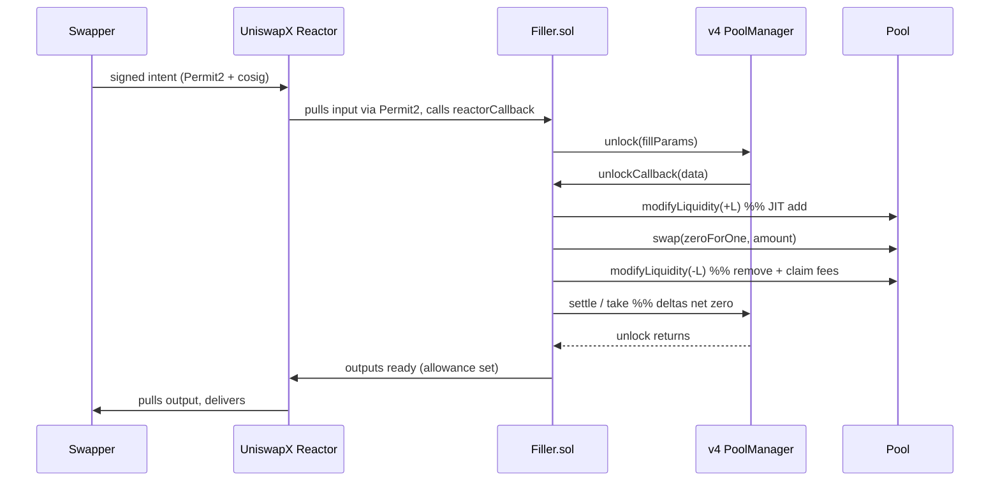

# Atomic JIT Pattern

The on-chain primitive at the heart of Filler SDK: `add → swap → remove → settle`, executed atomically inside a single `PoolManager.unlock` callback.

## The problem

UniswapX intents arrive at the Reactor as signed orders. To fill one, a solver must deliver the user's output token at the agreed-upon price. Most institutional solvers do this from inventory — they hold large balances and dispense from a stockpile.

Two problems with that approach:

1. **Capital intensive.** You need millions in inventory to compete on majors.
2. **Slow to respond.** When inventory drains during a busy period, fills stall until rebalance.

## The solution

Instead of pre-stocking inventory, **add liquidity to a v4 pool just-in-time**, route the user's swap through that liquidity, and **remove the liquidity in the same transaction**.

```
1. User signs intent off-chain          (Permit2 EIP-712 + cosignature)
2. Reactor pulls input via Permit2      → transfers to Filler
3. Filler enters v4 unlock context      (PoolManager.unlock)
4. Filler adds JIT liquidity            (modifyLiquidity, +liquidityDelta)
5. Filler swaps user input              (swap zeroForOne, consumes JIT range)
6. Filler removes JIT liquidity         (modifyLiquidity, -liquidityDelta + fees)
7. Filler settles deltas to zero        (sync + take + settle)
8. Reactor pulls output from Filler     → delivers to swapper
```

All in **one transaction**. If any step reverts, the whole tx reverts. Atomicity is the foundation.

## Sequence diagram



## Why this works

1. **No persistent inventory** — liquidity is created and destroyed within the tx
2. **Captures swap fees** — the Filler IS the LP for that one swap; the entire fee on the JIT-provided range accrues to it
3. **Atomic** — `_assertDeltasZero` enforces no currency leaks; if anything's off, the whole tx reverts
4. **Composable** — works on any v4 pool without adversarial hooks (Detox-Hook-style anti-JIT pools are detectable + skippable)

## The contract — verifiable

The whole pattern is ~50 lines in [`Filler.sol`](https://github.com/filler-sdk/filler-sdk/blob/main/contracts/src/Filler.sol):

```solidity
function unlockCallback(bytes calldata data) external onlyPoolManager returns (bytes memory) {
    FillParams memory p = abi.decode(data, (FillParams));
    _addJitLiquidity(p);
    _swap(p);
    _removeJitLiquidity(p);
    DeltaSettler.settleAll(POOL_MANAGER, p.poolKey);
    _assertDeltasZero(p);
    return "";
}
```

Pragma 0.8.30, EVM Prague, transient reentrancy guard (`bool transient locked`) for ~2,100 gas savings vs SSTORE-based ReentrancyGuard.

See it execute on a mainnet fork:

```bash
bun run e2e:fork
# → ✓ tx mined SUCCESS: 0x161127…ae5300d  (block 25010080)
# → trace it: cast run <txHash> --rpc-url http://localhost:8545
```

## Tradeoffs

| Tradeoff | Implication |
|---|---|
| **Gas baseline ~500K** | JIT add + swap + remove + settle. Below ~$50 per fill, the gas cost dominates the spread |
| **Hook compatibility** | Pools with anti-JIT hooks (Detox-Hook-style) reject the pattern. SDK pre-flight detects + skips |
| **Tick range precision** | Off-chain math computes optimal range. Too wide → fees diluted; too narrow → swap exits range, reverts |
| **Output-token inventory** | In-range JIT requires the Filler to hold output-currency inventory ([F-66](/resources/feedback)). Treasury-rebalance vertical absorbs this naturally |

The off-chain calibration is where the SDK adds value. See [JIT Inventory Hints](/docs/concepts/jit-hints).

## Read the code

- Smart contract: [`contracts/src/Filler.sol`](https://github.com/filler-sdk/filler-sdk/blob/main/contracts/src/Filler.sol)
- Off-chain calibration: [`packages/sdk/src/fills/tickCalibration.ts`](https://github.com/filler-sdk/filler-sdk/blob/main/packages/sdk/src/fills/tickCalibration.ts)
- Delta settler: [`contracts/src/libraries/DeltaSettler.sol`](https://github.com/filler-sdk/filler-sdk/blob/main/contracts/src/libraries/DeltaSettler.sol)
- E2E proof: [`packages/sdk/scripts/e2e-fork.ts`](https://github.com/filler-sdk/filler-sdk/blob/main/packages/sdk/scripts/e2e-fork.ts)

## Next

- [JIT Inventory Hints](/docs/concepts/jit-hints) — how the indexer surfaces fillable depth
- [Bond Mechanism](/docs/concepts/bond) — the slashable accountability primitive
