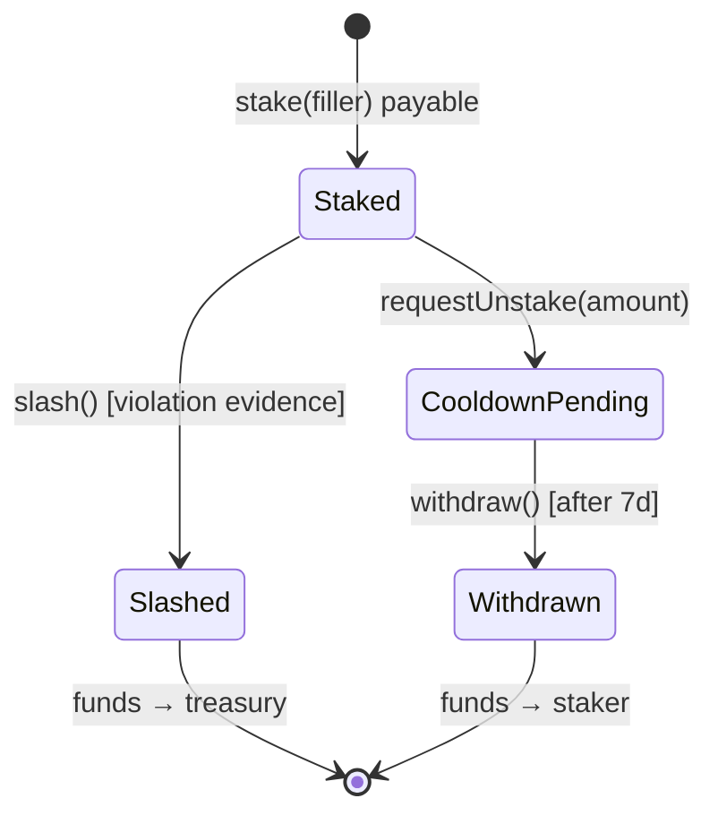

# Bond Mechanism

`FillerBond.sol` — a stake/slash bond contract for filler accountability. The accountability primitive that lets users delegate execution to a vertical solver.

## Lifecycle



1. **Stake** — operator (or any third-party staker) calls `bond.stake(filler)` with ETH; `Staked(filler, staker, amount)` event fires
2. **Operate** — Filler executes intents; every fill is observable on chain
3. **Slash** (if a violation occurs) — bond owner submits evidence hash + amount; slashed funds → treasury
4. **Request unstake** — staker calls `bond.requestUnstake(filler, amount)` to start a 7-day cooldown
5. **Withdraw** — after 7 days, staker calls `bond.withdraw(filler)` to retrieve unstaked funds

## v0 design (current — Sprint 5.5)

| Property | Choice | Rationale |
|---|---|---|
| **Slasher** | Bond owner (multisig) | Trust-minimized: requires 2/3 multisig threshold (no EOA owner). [ADR 0002](/resources/adrs) |
| **Cooldown** | 7 days | Bounds slashing windows: an operator misbehaving has 7 days to be slashed before stake exits |
| **Evidence** | Hash on-chain | Cheap; off-chain witnesses verify the hash matches their reconstruction |
| **Multi-staker** | Supported | Multiple addresses can back the same Filler. Slashing reduces pro-rata |
| **LST collateral** | Not yet | v1 roadmap — stETH/rETH would require oracle pricing layer |

The v0 trust model is honest: the bond owner is a multisig, and slashing is the multisig's call. That's the same trust model UniswapX itself runs at v0 (Reactor owner is Uniswap Timelock). [ADR 0002](/resources/adrs) documents the v0→v1 plan with explicit migration steps.

## v1 roadmap (Q4 2026)

- **Trustless slashing** — anyone submits a Merkle proof of a Reactor event; the contract verifies inclusion + slashes deterministically
- **Multi-violation severity** — different slash percentages per violation type (failed-fill-after-quote-commitment vs. quote-without-intent vs. malicious-fill)
- **Stake-weighted lottery** — bootstrap mechanism: new solvers without on-chain reputation get a fraction of the slot allocation proportional to stake
- **LST collateral** — stETH / rETH supported alongside native ETH

## Why bond at all?

UniswapX itself doesn't impose collateral on fillers — anyone can register. The Filler bond is **off-chain credibility**, not protocol-enforced collateral. It exists for verticals where users delegate execution:

- **DAO treasuries delegating rebalances** — DAO needs recourse if the solver misbehaves on a $50M rebalance
- **Vault products composing solver with strategy** — vault depositors need recourse if the solver causes loss
- **Research teams running experimental strategies** — counterparties need confidence the strategy isn't malicious

Without the bond, those users have no on-chain claim. With it, slashed funds go to a pre-configured treasury (which can be a victim restitution multisig).

## Read the code + the proof

```bash
$ bun run e2e:fork
# step 7 of the orchestrator:
→ Staking bond from solver wallet
  ✓ stake: 0.1 ETH
  ↗ stake tx: 0xcc903b…015b4f0bd

$ cast call 0x559Bb2F2beb43246bA63057F3750b742b92dBBf9 \
    'stakeOf(address,address)(uint256)' \
    0xC489d11D03B2999A6ba568e02E0b95eFc58b6A34 \
    0xfaa792ce4873945cD67CEB5BcAeA0B84eb455510 \
    --rpc-url http://localhost:8545
100000000000000000  # 0.1 ETH
```

- Smart contract: [`contracts/src/FillerBond.sol`](https://github.com/filler-sdk/filler-sdk/blob/main/contracts/src/FillerBond.sol)
- Bond client SDK: [`packages/sdk/src/bond/`](https://github.com/filler-sdk/filler-sdk/tree/main/packages/sdk/src/bond)
- ADR for v0→v1 plan: [`docs/adr/0002-bond-v0-owner-slash.md`](https://github.com/filler-sdk/filler-sdk/blob/main/docs/adr/0002-bond-v0-owner-slash.md)
- Stake script: [`examples/treasury-rebalance/src/stake.ts`](https://github.com/filler-sdk/filler-sdk/blob/main/examples/treasury-rebalance/src/stake.ts)

## Next

- [Bond Lifecycle Guide](/docs/guides/bond) — operational walkthrough (stake → operate → unstake)
- [Production Checklist](/docs/guides/production) — what to verify before going live with a bond
