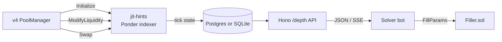

# JIT Inventory Hints

The genuinely-novel primitive that defines Filler SDK as more than a wrapper. No other tool exposes this as a library.

## What's missing in the Trading API

Uniswap's Trading API (`https://trade-api.gateway.uniswap.org/v1/quote`) is excellent at what it does, but it answers a different question than a JIT solver needs:

| Trading API returns | JIT solver needs |
|---|---|
| ✅ Best route across pools | ❌ Available depth *unfilled at price X* |
| ✅ Output amount with slippage | ❌ Optimal tick range for JIT-add |
| ✅ Calldata to execute | ❌ Expected fee capture from a JIT operation |
| ✅ Quote freshness window | ❌ Real-time depth updates as state changes |

Building the right side of that table requires:

1. Indexing every `ModifyLiquidity` + `Swap` event from `PoolManager`
2. Maintaining tick-level liquidity state per pool, per chain
3. Computing depth at arbitrary price levels in `<100ms`
4. Streaming updates sub-second via WS/SSE

That's the indexer infrastructure that takes weeks to build. **`@filler-sdk/jit-hints` ships it as a library.**

This is the difference between being "an SDK wrapper around UniswapX" and being **infrastructure** that opens a category of solvers. Without this primitive, every vertical solver re-builds the same v4 indexer.

## What the indexer does



Every step is open-source ([packages/jit-hints/](https://github.com/filler-sdk/filler-sdk/tree/main/packages/jit-hints)) and self-hostable.

## API surface

### HTTP — `GET /depth/:poolId`

```bash
curl 'http://localhost:42069/depth/0xa7e811…755f1?atSqrtPrice=...&direction=token0' | jq
```

```json
{
  "hint": {
    "tickLower": 197860,
    "tickUpper": 199860,
    "liquidityDelta": "1000000000000",
    "expectedFee": "300000",
    "sqrtPriceImpact": "12345678901234"
  }
}
```

### TypeScript — `calculateDepthHint`

```typescript
import { calculateDepthHint } from '@filler-sdk/jit-hints';

const hint = calculateDepthHint(pool, ticks, {
  poolId: '0xa7e811…755f1',
  tradeSize: 100_000_000n,    // 100 USDC (6 decimals)
  zeroForOne: true,
  slippageBps: 50,
  feeBps: pool.fee,           // pool's own fee tier
});
```

Returns:

```typescript
{
  recommendedTickLower: 197860,
  recommendedTickUpper: 199860,
  recommendedLiquidityDelta: 1_000_000_000n,
  expectedFeeCapture: 300_000n,        // ~$0.30
  expectedSlippageBps: 5,
  expectedGasOverhead: 500_000n,
  estimatedNetProfit: 250_000n,        // = fee − gas (in input-token units)
}
```

## The algorithm

1. **Project target sqrtPrice** after the swap, given current pool state + slippage tolerance
2. **Determine tick range** the swap will traverse (zeroForOne ↓, oneForZero ↑)
3. **Compute `liquidityDelta`** required for the JIT range to absorb the swap without exiting (sqrtPriceLimit math)
4. **Estimate fee capture** = `tradeSize × feeBps / 10_000`, scaled by JIT-share of total in-range liquidity
5. **Subtract gas cost** in input-token-equivalent (via gas oracle)
6. **Return optimal range** with safety margin applied (`safetyMarginTicks * tickSpacing` per side)

The TickMath BigInt port that powers steps 1–3 is in [`packages/jit-hints/src/tickMath.ts`](https://github.com/filler-sdk/filler-sdk/tree/main/packages/jit-hints/src) — kept in sync with the Solidity `TickMath.sol` from v4-core.

## How the SDK consumes it

```typescript
import { createFillerFromPrivateKey } from '@filler-sdk/sdk';

const filler = createFillerFromPrivateKey({
  // ...
  indexer: { baseUrl: 'http://localhost:42069' },
});

// Internally, prepareFill() queries the indexer:
const fillParams = await filler.prepareFill(intent);
// → returns null if no fillable depth, or { poolKey, tickLower, tickUpper, liquidityDelta, ... }
```

The `tickCalibration.ts` layer in the SDK refines indexer hints into v4-safe ticks (snaps to `tickSpacing`, applies safety margins, caps liquidity multipliers). See [`packages/sdk/src/fills/tickCalibration.ts`](https://github.com/filler-sdk/filler-sdk/blob/main/packages/sdk/src/fills/tickCalibration.ts).

## Why this is the differentiator

**vs. CoW solver SDK**: CoW requires registration, hosted infra, institutional team. JIT-hints is `bun install`.

**vs. UniswapX without hints**: institutional fillers reverse-engineer this internally. Public solvers can't, until now.

**vs. Tycho**: Tycho is the broader inspiration (UF-funded $500K v4 indexing). JIT-hints is a focused subset: tick state + JIT depth + sub-second update — exactly what UniswapX vertical solvers need.

The TickMath BigInt port + the depth calculator are the parts no one else publishes.

## Honest scope

What `@filler-sdk/jit-hints` does NOT yet ship:

- **Multi-chain hot-failover** — runs per-chain; cross-chain coordination is roadmap
- **Hook-aware depth** — assumes vanilla v4 pools; hook side-effects on liquidity not modeled
- **MEV-aware depth** — adversarial reordering not factored into expectedFeeCapture

The indexer is open-source — every gap is a fork-able PR. We track these in the [roadmap](/resources/roadmap).

## Read the code

- Indexer source: [`packages/jit-hints/`](https://github.com/filler-sdk/filler-sdk/tree/main/packages/jit-hints)
- TickMath port: [`packages/jit-hints/src/tickMath.ts`](https://github.com/filler-sdk/filler-sdk/blob/main/packages/jit-hints/src/tickMath.ts)
- SDK consumption: [`packages/sdk/src/fills/tickCalibration.ts`](https://github.com/filler-sdk/filler-sdk/blob/main/packages/sdk/src/fills/tickCalibration.ts)

## Next

- [Atomic JIT Pattern](/docs/concepts/atomic-jit) — how the on-chain side consumes the hints
- [Topology](/docs/concepts/topology) — where the indexer fits in the architecture
