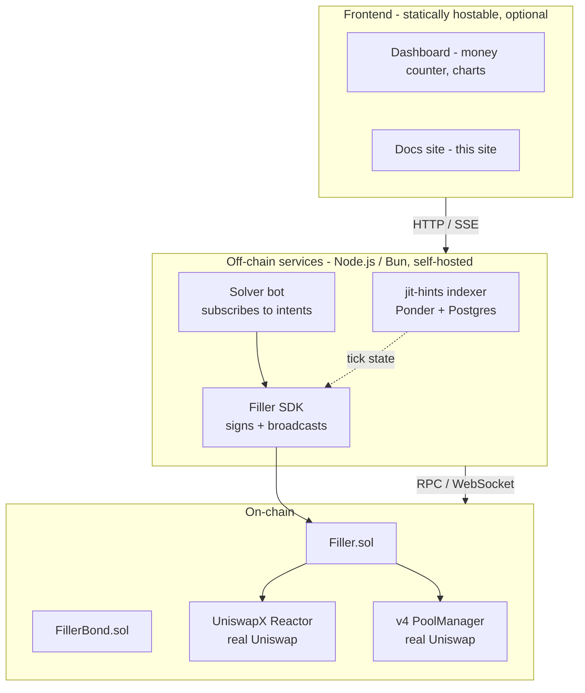

# Topology — Self-Hosted, Not SaaS

Filler SDK ships as **npm packages + Docker images + Foundry artifacts** that customers run on their own infrastructure. We don't operate any service for customers. Same model as Foundry, Tycho, Ponder.

## Three layers



## What we ship vs operate

| What we ship | What we operate |
|---|---|
| `@filler-sdk/sdk` (npm) | Nothing for customers |
| `@filler-sdk/jit-hints` (npm + docker image) | The repo + docs site only |
| `create-filler` (npm) | — |
| `Filler.sol` + `FillerBond.sol` (Foundry artifacts + bytecode) | — |

Customer infra runs the indexer + solver bot + dashboard against their RPC + Postgres + signing keys. We don't see any customer state.

## Why off-chain components exist

> Q: "Isn't this Web3 — shouldn't everything be on-chain?"

Three off-chain components are **architectural necessities**, not lazy choices:

1. **Indexer** — must continuously listen to PoolManager events. Browser-side impossible (closes connection, loses state, RPC limits).
2. **Solver bot** — must subscribe to the intent stream 24/7. Needs persistent connection + signing keys without manual click.
3. **Tick range calibration** — too computationally heavy to do in each quote from a frontend; needs cached tick state.

The on-chain primitives (Filler + Bond) handle settlement + accountability. Off-chain handles observation + decision. Same shape as every production solver (Wintermute, SCP, Propeller all run off-chain bots).

## Why NOT SaaS

| SaaS posture | Filler SDK posture |
|---|---|
| Auth, accounts, sessions | None |
| User database | None — only on-chain state matters |
| Centralized API gateway | Each customer runs their own |
| Multi-tenant infra | Self-hosted libraries |
| We operate infra for customers | Customers self-host |
| Single point of failure | Failure isolated per customer |

The three reasons against SaaS, in priority order:

1. **Trust minimization.** Solvers shouldn't reveal their strategy to a third party. Self-host = no leakage.
2. **Composability.** Every primitive is replaceable. Customer can swap our indexer for Tycho's, our SDK for a fork — nothing locks them in.
3. **Foundation alignment.** UF funds infra, not SaaS. Tycho ($500K), OpenZeppelin Hooks Library ($850K), Ponder, Foundry — all self-hostable.

## Implications — the panel Q&A

> **Q: What happens if your team disappears?**
>
> **A:** Nothing. MIT license, immutable contracts (no upgrade keys we hold), self-hosted off-chain components. Anyone can fork the repo, rebuild the docker images, redeploy. We're a library, not a vendor.

> **Q: Single point of failure?**
>
> **A:** No central API. Each customer runs their own indexer + bot. One customer's RPC outage doesn't affect another's. The on-chain components are Uniswap's own contracts (Reactor, PoolManager) — same SPOF as any UniswapX integration.

> **Q: Is there a hosted version?**
>
> **A:** Optional in Q1 2027 roadmap (post-audit, post-hackathon). Self-host is always available + recommended for trust-minimized operation. Hosted tier exists for teams that want the convenience tax.

> **Q: How do you make money?**
>
> **A:** Post-hackathon, the path is Uniswap Foundation grant funding for the open-source SDK. Hosted tier (Q1 2027) is optional revenue. We don't take a fee on fills — that would compromise self-hostability.

## Component dependencies

```
Filler.sol           depends on  UniswapX Reactor + v4 PoolManager
FillerBond.sol       depends on  nothing (standalone)
@filler-sdk/sdk      depends on  Filler/Bond addresses + RPC + indexer (optional)
jit-hints indexer    depends on  PoolManager events from RPC + Postgres
Solver bot           depends on  SDK + private key + RPC
Dashboard            depends on  solver SSE + indexer HTTP (both optional, replay mode works offline)
```

Every dependency is replaceable except Uniswap's own contracts. The dashboard's `?replay=` mode works without ANY off-chain component — useful for the demo recording.

## Production deployment shape

A real customer deployment looks like:

```
Customer infra:
  ├── 1× Postgres (RDS / Supabase / self-hosted)
  ├── 1× Indexer service (Railway / Fly / k8s)
  ├── 1× Solver bot (Railway / Fly / k8s)
  ├── 1× Dashboard (Vercel / Cloudflare Pages — static)
  └── 0× anything from us

Uniswap-side:
  ├── UniswapX Reactor at the chain's canonical address
  ├── v4 PoolManager at the chain's canonical address
  └── (no central API needed; SDK speaks RPC directly)
```

See [`packages/jit-hints/deploy/`](https://github.com/DavidZapataOh/filler-sdk/tree/main/packages/jit-hints/deploy) for Railway + Fly + Docker Compose deploy manifests.

## Read the code

- Architecture overview: [README.md](https://github.com/DavidZapataOh/filler-sdk#readme)
- Indexer deploy options: [`packages/jit-hints/deploy/RUNBOOK.md`](https://github.com/DavidZapataOh/filler-sdk/blob/main/packages/jit-hints/deploy/RUNBOOK.md)
- Hero example deploy: [`examples/treasury-rebalance/.env`](https://github.com/DavidZapataOh/filler-sdk/blob/main/examples/treasury-rebalance/.env)

## Next

- [Verticals](/docs/concepts/verticals) — what kinds of solvers this topology supports
- [Production Checklist](/docs/guides/production) — operational guardrails for going live
