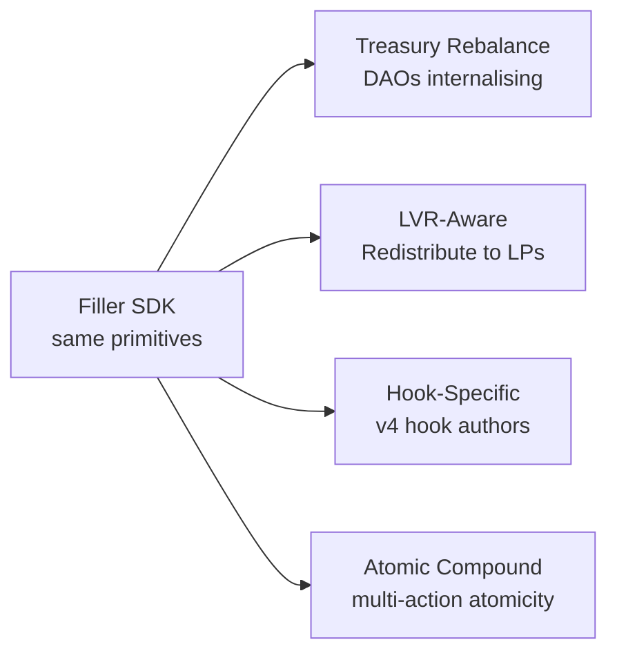
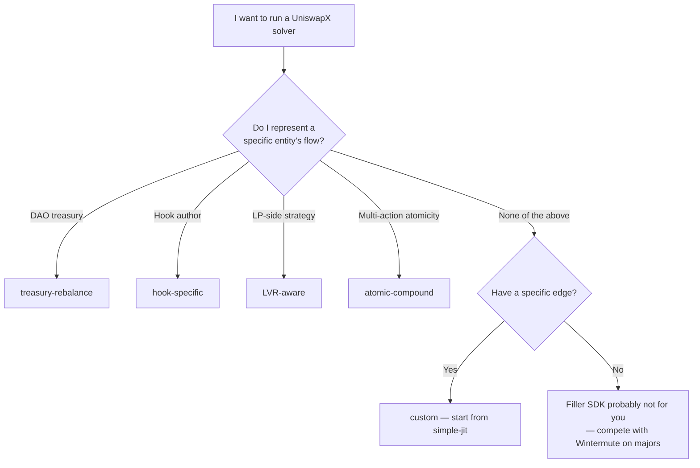

# Verticals

Filler SDK enables vertical solvers institutional desks don't reach. Same SDK, same contracts, same on-chain primitives — the only delta between verticals is `strategy.ts`.

## The thesis

Today, ~10 institutional desks (Wintermute, SCP, Propeller, Barter, Project Blanc) optimize for **majors** (ETH/USDC, BTC/USDC, stables). They have CEX-grade pricing pipelines we can't compete with.

Filler SDK doesn't compete on majors. It enables the **50+ verticals** where they don't reach. The Amazon-vs-Walmart analogy: Walmart dominates general merchandise of high volume; Amazon won by aggregating the long tail. Each SKU is small; the aggregate is $1T+. Wintermute is Walmart of the solver business — Filler SDK is the infrastructure for the Amazon-of-segment.

## The four canonical verticals



### 1. Treasury Rebalance — the hero example

A DAO with $50M+ in treasury rebalances quarterly. With aggregators it pays 10–30 bps in spread; for $50M of rebalance, that's **$50K–$150K quarterly** lost to externals.

With Filler SDK + the [treasury-rebalance recipe](/recipes/treasury-rebalance), the DAO's solver fills the DAO's intents — spread stays internal.

```typescript
// strategy.ts — accept ONLY intents from the DAO treasury wallet
filter(intent: Intent): boolean {
  return intent.swapper.toLowerCase() === DAO_TREASURY.toLowerCase();
}
```

**Customer**: Aave, Compound, Frax, ENS, Optimism Collective, Karpatkey-managed treasuries. Anyone with $10M+ in treasury and quarterly rebalance routine.

**Hero example shipped**: [`examples/treasury-rebalance`](https://github.com/filler-sdk/filler-sdk/tree/main/examples/treasury-rebalance) — workspace-linked, runs against an anvil mainnet fork via `bun run e2e:fork`.

### 2. LVR-Aware

LVR (loss-versus-rebalancing) is the cost passive LPs pay to arbitrageurs. Conventional solvers extract it. **LVR-aware solvers explicitly redistribute a fraction back to LPs** in the consumed range — making the strategy compatible with LP-protective DAOs.

```typescript
decide(intent: Intent, params: FillParams): boolean {
  // Reject if redistribution would make the fill unprofitable
  return params.feesCaptured > redistributionAmount(intent);
}
```

**Customer**: vault products that act as LPs in v4 pools (Arrakis-style, Bunni-style). Running an LVR-aware solver on top of their LP positions captures dual revenue (LP fees + JIT spread).

[Recipe →](/recipes/lvr-aware)

### 3. Hook-Specific

Every new v4 hook is a **6–12 month window without solver coverage**. Hook authors run their own Filler-based solver to ensure their hook has fillable liquidity from day 1 of public launch.

```typescript
const TARGET_HOOK = '0x...';  // your hook contract

filter(intent: Intent): boolean {
  // Accept intents that route through pools using OUR hook
  return intent.poolKey.hooks.toLowerCase() === TARGET_HOOK.toLowerCase();
}
```

**Customer**: hook authors. Detox-Hook (anti-MEV), oracle-hooks, dynamic-fee hooks, KYC-gated hooks — any v4 hook that needs solver coverage to bootstrap.

[Recipe →](/recipes/hooks)

### 4. Atomic Compound

Fills composed with **other on-chain actions in one tx** — yield deposits, hedge legs, governance actions. Removes inter-step inventory risk + opens novel strategies.

```typescript
// strategy.ts — accept compound intents the SDK doesn't natively support
filter(intent: Intent): boolean {
  return intent.additionalValidationData.startsWith(YIELD_DEPOSIT_PREFIX);
}

// extend Filler.execute to chain through Aave deposit / Lido stake / etc.
```

**Customer**: structured products, vault aggregators, programmable money. Anyone whose strategy has more than one on-chain leg.

This vertical requires a **custom Filler.sol fork** (the canonical Filler is single-action). The SDK still handles intent subscription + signing.

## What we DON'T enable

We're upfront: Filler SDK does NOT enable competing with Wintermute / SCP / Propeller on majors. They have:

- Multi-venue CEX/DEX pricing pipelines
- Institutional inventory management
- Regulatory clarity for institutional capital
- Decade-old infrastructure

Trying to compete on their turf with this SDK = lose. We enable the **categories they can't economically reach**, where the unit-economics work for a smaller team or single-vertical operator.

## Vertical selection — flowchart



## Recipe links

- [Simple JIT](/recipes/simple-jit) — minimum viable, single-pool baseline
- [LVR-Aware](/recipes/lvr-aware) — redistribute to LPs
- [Treasury Rebalance](/recipes/treasury-rebalance) — DAO internalisation (hero example)
- [Hook-Specific](/recipes/hooks) — v4 hook authors
- See [Recipes overview](/recipes) for the full table

## Read the code

- All four templates: [`packages/cli/templates/`](https://github.com/filler-sdk/filler-sdk/tree/main/packages/cli/templates)
- Hero example (workspace-linked): [`examples/treasury-rebalance/`](https://github.com/filler-sdk/filler-sdk/tree/main/examples/treasury-rebalance)

## Next

- [Recipes](/recipes) — copy-pasteable starter for each vertical
- [Deploying a Solver](/docs/guides/deploy) — `npx create-filler` walkthrough
