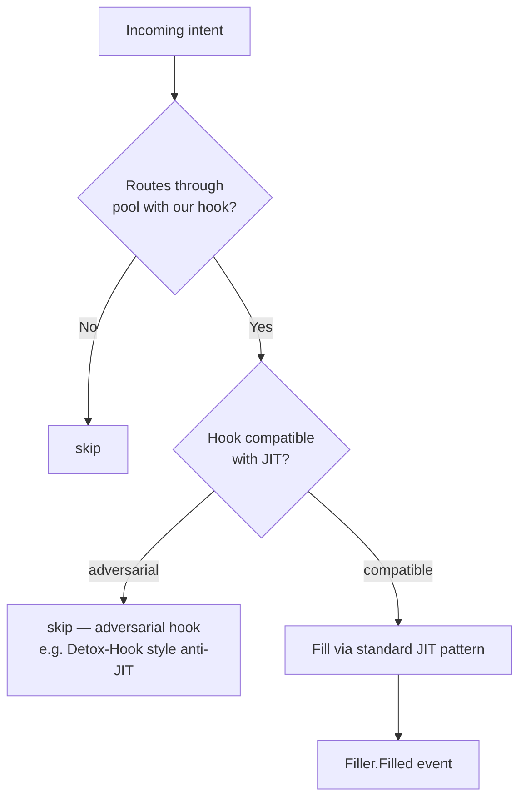

# Hook-Specific Recipe

A solver scoped to a specific v4 hook. The play: hook authors run their own Filler-based solver to ensure their hook has fillable liquidity from day 1 of public launch.

## Why this is a real vertical

Every new v4 hook is a **6–12 month window without institutional solver coverage**. Wintermute / SCP / Propeller don't add coverage for new hooks until volume + risk-adjusted returns justify the integration effort.

Hook authors face a chicken-and-egg problem:
- Users won't route through a hook without solver coverage (no fillable depth)
- Solvers won't add coverage without volume (no economic incentive)

The hook team can break the deadlock by **running their own solver** on day 1. Capture every fill on their hook's pools, build reputation, hand off to institutional solvers when volume justifies their attention.

## Use case

You're a hook author. Your hook is deployed at `0xHookAddress`. You want to:

- Ensure pools using your hook have fillable depth from launch day
- Capture fee economics that demonstrate the hook's economic viability
- Build a public track record (every fill is on-chain, audit-able by integration partners)

## How it works



The strategy filter narrows to intents routing through pools with the target hook. The `decide` step checks hook compatibility — some hooks intentionally reject JIT (e.g., anti-MEV hooks), and the solver should detect + skip those.

## Setup

```bash
npx create-filler my-hook-bot --template custom --chain unichain
cd my-hook-bot
```

The `custom` template ships a minimal scaffold — adapt for your specific hook.

## Strategy

```ts
import type { Address } from 'viem';
import type { FillParams, Intent } from '@filler-sdk/sdk';

const TARGET_HOOK = '0xYourHookAddress' as Address;
const KNOWN_ADVERSARIAL_HOOKS = new Set<Address>([
  // Anti-JIT hooks — extend as the v4 hook ecosystem matures
  // '0x...' as Address,  // Detox-Hook example
]);

export const strategy = {
  filter(intent: Intent): boolean {
    // The poolKey for the intent's route — comes from the SDK
    // (intent.poolKey is populated by the indexer when prepareFill runs)
    return intent.poolKey?.hooks.toLowerCase() === TARGET_HOOK.toLowerCase();
  },

  decide(_intent: Intent, params: FillParams): boolean {
    if (KNOWN_ADVERSARIAL_HOOKS.has(params.poolKey.hooks.toLowerCase() as Address)) {
      return false;
    }
    // Hook-specific decision logic — e.g., reject if hook's fee is exotic
    // or if hook intercepts swap in a way that breaks delta-net-zero
    return true;
  },
};
```

## Hook compatibility — pre-flight check

Some hooks override `beforeSwap` or `beforeAddLiquidity` in ways that make the JIT pattern revert. Symptoms:

- `Filler.execute` reverts at `_addJitLiquidity` (hook's `beforeAddLiquidity` rejected the JIT add)
- `Filler.execute` reverts at `_swap` (hook's `beforeSwap` blocked the swap)
- `_assertDeltasZero` fails (hook re-routed currency to itself)

For each candidate hook, simulate before deploying production solver coverage:

```bash
# Future SDK helper (roadmap):
bun run --filter @filler-sdk/sdk simulate-hook \
  --hook 0xYourHookAddress \
  --pool-currency0 USDC \
  --pool-currency1 WETH \
  --fee 500
```

For now, simulate on a fork: deploy a Filler against an anvil mainnet fork that includes your hook's deployed address, run a synthetic intent through it, observe whether the JIT pattern completes.

## Production checklist (extra hook-specific items)

In addition to the [standard production checklist](/docs/guides/production):

- [ ] **Hook contract audited** — your hook's audit precedes the solver going live
- [ ] **Adversarial-hook list maintained** — keep `KNOWN_ADVERSARIAL_HOOKS` updated as new patterns emerge
- [ ] **Hook upgrade coordination** — if your hook is upgradable (proxy), establish a process to pause solver during upgrades
- [ ] **Public track record** — emit indexed events from your hook that the solver can correlate; reputation is the recipe's long-term value

## Related

- [Atomic JIT Pattern → Hook compatibility](/docs/concepts/atomic-jit) — what makes a hook "compatible"
- [Verticals → Hook-Specific](/docs/concepts/verticals) — full thesis on the 6–12 month window
- [v4 Hooks reference](https://docs.uniswap.org/contracts/v4/concepts/hooks) — Uniswap's hook docs
- [F-65 in FEEDBACK.md](/resources/feedback) — v4 mainnet adoption gap (most v4 activity is on Unichain — likely where your hook ships first)
