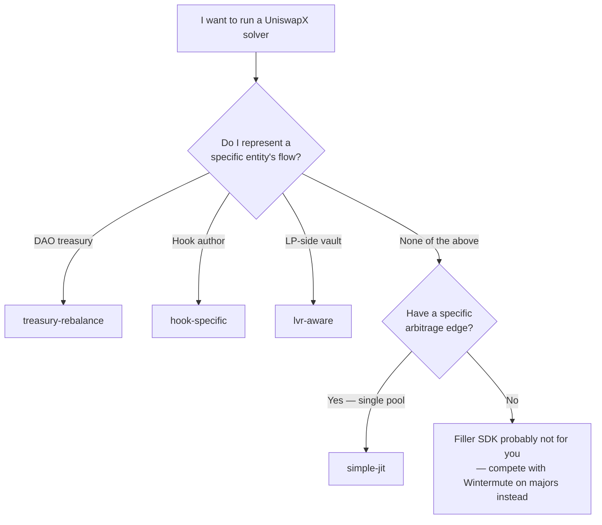

# Recipes

Copy-pasteable solver templates for each of the canonical [verticals](/docs/concepts/verticals). Same SDK, same contracts, same on-chain primitives — the only delta between recipes is `strategy.ts`.

## The catalog

| Recipe | Customer | Margin | Status |
|---|---|---|---|
| [Treasury Rebalance](/recipes/treasury-rebalance) — **HERO** | DAOs internalising treasury rebalances ($10M+ treasuries) | 100% spread → DAO | ✅ shipped, working in repo |
| [Simple JIT](/recipes/simple-jit) | Single-pool arbitrageurs | 100% spread → solver | ✅ recipe + template |
| [LVR-Aware](/recipes/lvr-aware) | LP-protective vaults, hook ecosystems | 75% solver / 25% LP | ✅ recipe + template skeleton |
| [Hook-Specific](/recipes/hooks) | v4 hook authors bootstrapping coverage | 100% solver | ✅ recipe + template (custom base) |

## Decision tree



## What every recipe shares

Each recipe ships the same shape:

```
my-solver/
├── package.json       # workspace dep on @filler-sdk/sdk
├── tsconfig.json
├── .env.example
└── src/
    ├── filler.ts      # main entry — subscribes to Reactor
    ├── strategy.ts    # filter + decide functions (the customisation surface)
    ├── config.ts      # env-validated config
    └── stake.ts       # one-time bond setup
```

Plus the on-chain bond stake (`0.1 ETH` minimum). Plus output-token inventory ([F-66](/resources/feedback)).

The 4 recipes differ only in `strategy.ts`. Everything else is shared infrastructure.

## How to evaluate a recipe before adopting it

1. **Read the recipe's "When NOT to use" section.** Each recipe is honest about when it's the wrong fit.
2. **Run `bun run e2e:fork`** against the canonical mainnet fork ([Quickstart](/docs/quickstart)). Confirms the orchestration works end-to-end on your machine before you customise.
3. **Adapt `strategy.ts`** for your filter + decide logic. Less is more — the SDK does the heavy lifting.
4. **Ship the [Production Checklist](/docs/guides/production)** before going live.

## What's NOT in this catalog

We're upfront: Filler SDK does NOT enable competing with Wintermute / SCP / Propeller on majors. They have:

- Multi-venue CEX/DEX pricing pipelines we don't ship
- Institutional inventory management we don't replicate
- Regulatory clarity for institutional capital we don't address
- A decade of solver infrastructure

The 4 recipes target the categories where the long-tail unit-economics work for a single-vertical operator. See [Verticals](/docs/concepts/verticals) for the full Amazon-vs-Walmart framing.

## Related

- [Verticals](/docs/concepts/verticals) — the category thesis
- [Quickstart](/docs/quickstart) — end-to-end smoke test in 5 minutes
- [Deploying a Solver](/docs/guides/deploy) — `npx create-filler` walkthrough
- [Production Checklist](/docs/guides/production) — what to harden before mainnet
