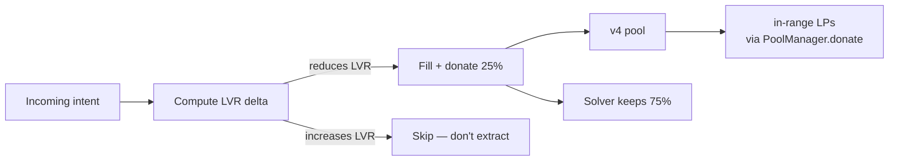

# LVR-Aware — LP-Protective Recipe

A solver that **redistributes a fraction of the JIT spread back to in-range LPs** as a core mechanic. Trades smaller per-fill margin for ecosystem alignment.

## What's LVR

Loss-Versus-Rebalancing — the cost passive LPs pay to arbitrageurs because LP positions are always re-priced AFTER swaps. Conventional solvers extract this. LVR-aware solvers explicitly redistribute a fraction (typically 25%) back to LPs.

The trade is **smaller solver margin (~75% of fees) in exchange for ecosystem alignment**. Suitable for:

- Operating in pools where you also LP (you'd be donating to yourself partially)
- Building reputation in DAO ecosystems that fund LP-friendly infra (Uniswap Foundation, Arrakis treasury)
- Aligning incentives with v4 hook ecosystems that mandate LP-favourable solvers (gated pools, KYA pools)

## How it works



1. Intent arrives via the SDK's `subscribeIntents`
2. Solver computes expected LVR delta if the fill happens (using a vol oracle of choice)
3. If LVR is REDUCED → fill executes + `PoolManager.donate(...)` returns 25% of the swap fees to in-range LPs
4. If LVR is unchanged or INCREASED → skip the fill (don't extract from LPs in adversarial scenarios)

## Setup

```bash
npx create-filler lvr-bot --template lvr-aware --chain unichain
cd lvr-bot
```

The template adds an `src/lvr.ts` module with the LVR delta calculation:

```ts
// src/lvr.ts (skeleton — plug in your vol oracle)
export async function calculateLVRDelta(
  intent: Intent,
  params: FillParams,
  ctx: { volOracle: VolOracle },
): Promise<{ delta: bigint; reduces: boolean }> {
  const vol = await ctx.volOracle.getVol(intent.input.token, intent.outputs[0].token);
  // Compute pre/post LVR based on swap size + price impact + volatility
  // Real implementation: use a model from a published LVR paper (e.g., Milionis et al.)
  // ...
  return { delta, reduces };
}
```

The `volOracle` is left as a swappable dependency — for production, integrate with [Pyth](https://pyth.network), [Chainlink](https://chain.link), or a custom indexer-derived feed.

## Strategy — donate fraction is the customisation knob

```ts
import type { Address } from 'viem';
import type { FillParams, Intent } from '@filler-sdk/sdk';
import { calculateLVRDelta } from './lvr';

const DONATE_BPS = 2500; // 25% — change to taste

export const strategy = {
  filter(_intent: Intent): boolean {
    // Accept anything; LVR check happens in decide
    return true;
  },

  async decide(intent: Intent, params: FillParams): Promise<boolean> {
    const { reduces } = await calculateLVRDelta(intent, params, ctx);
    return reduces;
  },

  // Hook for the SDK to inject donate logic
  postFillDonate: { enabled: true, bps: DONATE_BPS },
};
```

## On-chain donation primitive

The v4 PoolManager exposes [`donate(PoolKey, amount0, amount1)`](https://github.com/Uniswap/v4-core/blob/main/src/interfaces/IPoolManager.sol) which credits the donated amount pro-rata to in-range LPs. The Filler can call this from `unlockCallback` after the swap + before remove. The SDK wraps this as `params.donate0` / `params.donate1` fields when `postFillDonate.enabled = true`.

This is the same pattern the SDK already supports — see [`Filler.unlockCallback`](https://github.com/DavidZapataOh/filler-sdk/blob/main/contracts/src/Filler.sol).

## Why this might NOT work for you

- **Smaller margin** — 75% of typical Simple JIT
- **Vol oracle dependency** — needs reliable + low-latency price feed
- **Complex backtest** — LVR-aware fills are harder to reason about than pure profit-driven; needs dedicated simulation harness

If your unit economics don't tolerate 25% margin compression, this isn't the recipe.

## When this DOES work

- DAO-funded vault that holds passive LP positions + wants to reduce LVR exposure on its OWN positions
- v4 hook authors mandating LP-protective solvers as gating criterion (KYA hooks, governance-gated pools)
- Researchers experimenting with redistributive market microstructure

## Related

- [Concepts → JIT Inventory Hints](/docs/concepts/jit-hints) — fee capture + donate math
- [Atomic JIT Pattern](/docs/concepts/atomic-jit) — the on-chain primitive donate plugs into
- [Verticals](/docs/concepts/verticals) — when LVR-aware is the right fit
