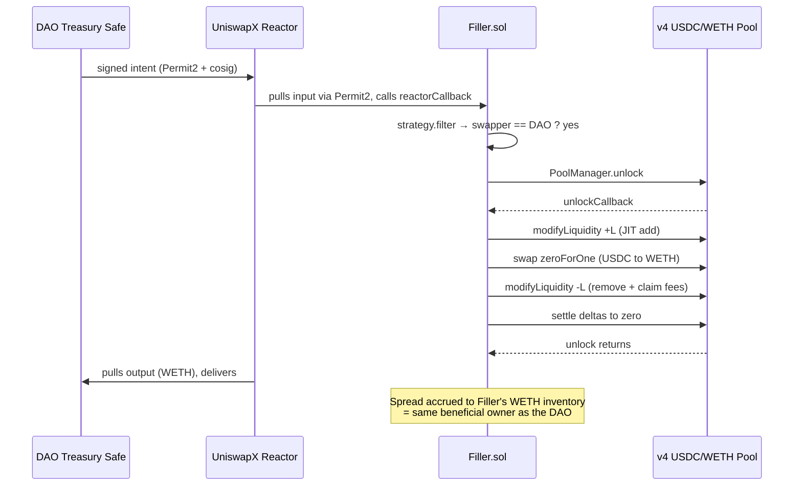

# Treasury Rebalance — Hero Recipe

> *"Your treasury used to be a cost center paying spread to aggregators. With this recipe, it becomes the solver capturing that same spread."*

The hero example. For DAOs with $10M+ treasuries that rebalance periodically and want to internalise the spread instead of paying it to a third-party aggregator.

## Use case

Every DAO with significant on-chain treasury rebalances pays 10–30 bps in spread. For a $50M rebalance, that's **$50K–$150K leaked per cycle**. Karpatkey-style treasury managers (Aave, Compound, Frax, ENS, Optimism Collective) all sit on top of this dynamic.

With this recipe, the DAO **is** the solver: the same wallet (or a delegated operator multisig) signs intents AND fills them. The JIT spread captured by the Filler ends up in the Filler's WETH inventory — same beneficial owner as the treasury.

## Architecture



The DAO's own bot fills the DAO's own intents. Spread captured by the JIT pattern stays inside the DAO.

## What ships in this repo

The hero recipe is materialised at [`examples/treasury-rebalance`](https://github.com/filler-sdk/filler-sdk/tree/main/examples/treasury-rebalance) — workspace-linked, ready to run against an anvil mainnet fork:

```
examples/treasury-rebalance/
├── package.json          # @filler-sdk/sdk: workspace:*
├── tsconfig.json
├── .env                  # wired to fork (chainId=31337)
└── src/
    ├── filler.ts         # main entry — branches on DEMO_MODE
    ├── config.ts         # filler-side env (Zod-validated)
    ├── treasury.ts       # treasury-side env (Zod-validated)
    ├── strategy.ts       # createTreasuryStrategy — filter by swapper
    ├── stake.ts          # one-time bond setup
    ├── dashboardEmitter.ts  # node:http SSE server on port 8080
    └── syntheticIntents.ts  # demo mode generator
```

## Setup (5 minutes)

```bash
git clone https://github.com/filler-sdk/filler-sdk
cd filler-sdk
bun install

# Bring up anvil fork + deploy + fund + stake + submit one intent → 25s
bun run e2e:fork
```

That's the proof. The orchestrator's tx hash + the dashboard counter are both live evidence that the recipe ships working.

## Configure for your DAO

Edit `examples/treasury-rebalance/.env`:

```bash
# === Treasury identity ===
TREASURY_ADDRESS=0x...                          # Your DAO Safe (or treasury operator address)

# === Production solver wallet (separate from treasury — see F-62) ===
SOLVER_PRIVATE_KEY=0x...                        # Fresh key, distinct from TREASURY_ADDRESS

# === Network ===
CHAIN_ID=1                                       # Production: 1 (mainnet) or 130 (Unichain)
RPC_URL=https://your-paid-rpc.example.com

# === Deployed contracts ===
FILLER_ADDRESS=0x...                            # Your Filler.sol deploy
BOND_ADDRESS=0x...                              # Your FillerBond.sol deploy
REACTOR_ADDRESS=0x00000011f84b9aa48e5f8aa8b9897600006289be  # mainnet UniswapX V2
POOL_MANAGER_ADDRESS=0x000000000004444c5dc75cb358380d2e3de08a90

# === Strategy ===
TARGET_ALLOCATIONS={"ETH":60,"USDC":40}
TOKEN_ADDRESSES={"ETH":"0xeee...","USDC":"0xa0b8..."}
REBALANCE_SCHEDULE=quarterly
MIN_REBALANCE_USD=10000

# === Production mode ===
DEMO_MODE=false
INDEXER_URL=https://your-indexer.example.com
```

## Strategy — the only file you customise

`src/strategy.ts` is 38 lines. The customisation is one identity check:

```ts
import type { Address } from 'viem';
import type { FillParams, Intent } from '@filler-sdk/sdk';

export function createTreasuryStrategy(
  treasuryAddress: Address,
): TreasuryStrategy {
  const target = treasuryAddress.toLowerCase();
  return {
    filter(intent: Intent): boolean {
      return intent.swapper.toLowerCase() === target;
    },
    decide(_intent: Intent, _params: FillParams): boolean {
      return true;
    },
  };
}
```

Other DAOs' intents flow through the Reactor too — your filler ignores them. Your filler exists to capture YOUR spread, not arbitrage everyone.

## Why "filler" + "treasury" must be different addresses

[F-62 in FEEDBACK.md](/resources/feedback) documents that anvil's well-known accounts have EIP-7702 SetCode delegation on mainnet. More fundamentally: even on a clean wallet, the swapper and solver MUST be separate addresses because:

- The Reactor uses Permit2 nonce uniqueness per signer
- A single wallet acting as both produces nonce conflicts under load

The recipe's `.env` enforces this with two separate keys: `TREASURY_ADDRESS` (signs intents) and `SOLVER_PRIVATE_KEY` (signs fills + bond stake). Both can be controlled by the same DAO multisig — they're just different on-chain accounts.

## Production checklist

Before going live with real treasury funds:

- [ ] **Audit**: contracts audited by Trail of Bits / Spearbit (post-hackathon roadmap — Q3 2026)
- [ ] **Bond**: `bond.stake(filler) >= chain.minStake` from a multisig, not an EOA
- [ ] **Multisig ownership**: `Filler.owner = Safe` (set during deploy via `MULTISIG_OWNER` env var)
- [ ] **Whitelist**: `configureApprovals([USDC, WETH, ...])` called by the multisig owner
- [ ] **Filler inventory**: pre-funded with output-token balance ([F-66](/resources/feedback) — in-range JIT requires both currencies)
- [ ] **Monitoring**: Prometheus metrics on `/metrics`, Sentry connected, structured logs piped to Loki
- [ ] **Alerting**: pages on solver downtime, low ETH balance, RPC errors
- [ ] **Backup solver**: secondary infra running the same code from a different region/RPC
- [ ] **Slashing playbook**: documented who slashes + what evidence + threshold ([ADR 0002](/resources/adrs))
- [ ] **First mainnet test**: small rebalance ($10K) before scaling to full treasury size
- [ ] **Operational runbook**: handover doc for treasury team — what to monitor, when to escalate
- [ ] **Demo mode disabled**: `DEMO_MODE=false` in production env

## When NOT to use this recipe

- **You don't have your own intent flow** — use [Simple JIT](/recipes/simple-jit) instead (fills random intents for fees)
- **You're an LP wanting to redistribute LVR** — use [LVR-Aware](/recipes/lvr-aware) instead
- **You're a v4 hook author bootstrapping coverage** — use [Hook-Specific](/recipes/hooks) instead

## Related

- [Atomic JIT Pattern](/docs/concepts/atomic-jit) — how the on-chain primitive works
- [Bond Mechanism](/docs/concepts/bond) — the slashable accountability primitive
- [Verticals](/docs/concepts/verticals) — full taxonomy + decision tree
- [Production Checklist](/docs/guides/production) — operational guardrails
- [F-66 in FEEDBACK.md](/resources/feedback) — output-token inventory architectural note
